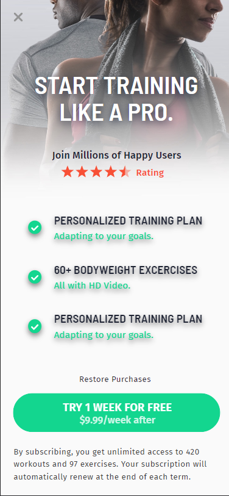

# Sports Paywall

> **Stack:** HTML + CSS (vanilla, no frameworks)
> **Origin:** Interview process with [**Bending Spoons**](https://bendingspoons.com), 2023.
> **Stage:** Automated pre-screening, emailed as part of the initial application response, before any human interview.
> **Outcome:** Passed this challenge; dropped at a later interview stage.

**Vanilla HTML + CSS pre-screening exercise for Bending Spoons, 2023. A pixel-faithful recreation of a mobile-app paywall screen from a design mockup, no frameworks, no bundler.**

A pixel-faithful recreation of a mobile-app paywall page for a fitness/training product, built from a design mockup using only HTML and CSS.



See [`original-README.md`](./original-README.md) for the README I wrote alongside the original repo.

## The problem

One challenge in a series of Bending Spoons technical exercises (titled "Problem 6" in the codebase). Given a design mockup of a paywall screen, recreate it faithfully in HTML + CSS.

**Constraints:**

- No JavaScript frameworks. Vanilla HTML + CSS only.
- Match the design closely: typography, spacing, colours, and layout.
- The page is static and non-interactive (by design).
- All assets (images, icons, fonts) shipped as local resources.

## My approach

- **Vanilla stack, no bundler.** The brief called for HTML + CSS, so adding a build step would have been over-engineering. Plain static files, no npm involvement.
- **Separated CSS into three files:** `globals.css` for resets and tokens, `animations.css` for motion primitives, `index.css` for page-specific styles. Keeps each concern in a predictable place.
- **Faithful asset handling.** Fonts and images included as local resources rather than CDN links, so the demo is self-contained and offline-viewable.
- **One shortcut, openly flagged.** The "reviews" section is delivered as an image in this non-interactive demo rather than as structured markup. Noted in an HTML comment at the call site. The kind of shortcut that's fine for a static mockup but would need to become real markup in a production paywall.

## Running it

No build step. Open `index.html` directly in any browser, or serve locally:

```bash
python3 -m http.server 8000
# then open http://localhost:8000
```

## Structure

```
index.html               Entry point
resources/
  css/
    globals.css          Reset + design tokens
    animations.css       Motion primitives
    index.css            Page-specific styles
  fonts/                 Local webfonts
  images/                Background, icons, review shots
preview.png              Rendered screenshot
```
