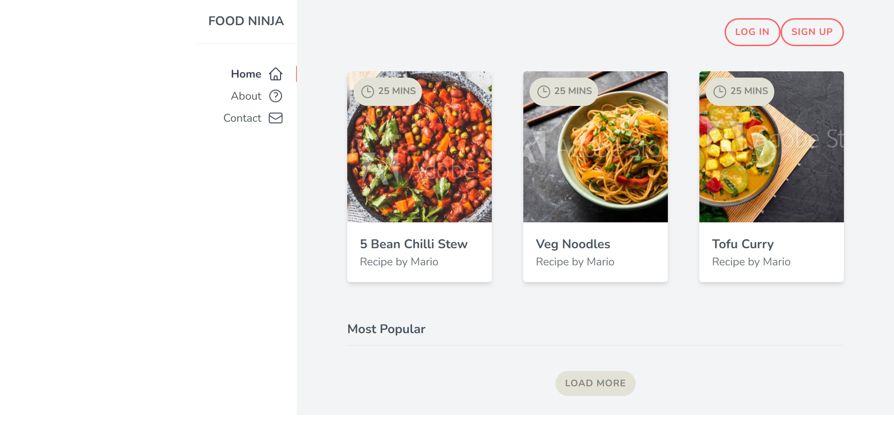

# The Net Ninja, Tailwind CSS Walkthrough

> **Type:** Course walkthrough (study material, not an interview challenge)
> **Source:** [The Net Ninja, Tailwind CSS Tutorial](https://youtu.be/bxmDnn7lrnk?list=PL4cUxeGkcC9gpXORlEHjc5bgnIi5HEGhw)
> **Prepared for:** [Syntheia](https://syntheia.io) frontend interview stage, 2023.

**Prep walkthrough of The Net Ninja's Tailwind CSS tutorial, completed ahead of the Syntheia frontend interview. Utility-first fundamentals, responsive design, and composition patterns.**

Walkthrough of The Net Ninja's Tailwind CSS tutorial, covering utility classes, responsive design, and composition patterns. Kept here as part of the record of what I studied ahead of the Syntheia frontend interview. The stack was Tailwind-heavy and I wanted full fluency with utility-first before the interview loop.



## Tech

- HTML
- Tailwind CSS
- JavaScript

## Running it

```bash
npm install
npm run dev
```

## Resources used

- [live-server](https://www.npmjs.com/package/live-server)
- [concurrently](https://www.npmjs.com/package/concurrently)
- [tailwindcss](https://v2.tailwindcss.com/docs)
- [heroicons](https://heroicons.com)
