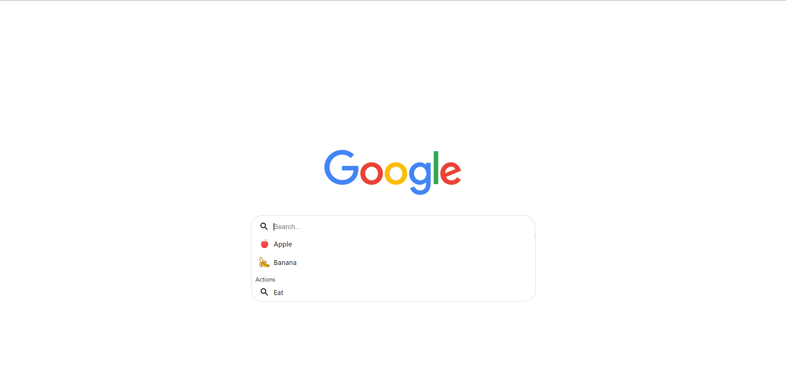

# Search Box

> **Stack:** React + TypeScript (CRA)
> **Origin:** Interview process with **Syntheia**, 2023.
> **Note:** This one came home. I'm now Director of Engineering at Syntheia.

**React + TypeScript take-home for Syntheia, 2023. A reusable, Google-style search box component with grouped suggestions, keyboard navigation, and fully-controlled props, built to live inside any state-management story.**

A reusable, Google-style search box component with suggestions, categorization, and keyboard navigation.



See [`original-README.md`](./original-README.md) for the README I wrote alongside the original repo.

## The problem

Build a reusable search box that resembles the Google search experience.

**Component behaviour:**

- Two views: closed (idle) and expanded (active).
- As the user types, suggestions appear from a provided list.
- On suggestion click or **Enter**, fire an `onSubmit()` event with the search term or suggestion name.
- **Esc** closes the suggestions and returns to idle view.
- Each suggestion can provide its own icon (defaults to a magnifier).
- Suggestions group into categories by type.

**Constraints:**

- All event handlers and state variables must be provided via props. This is a **controlled component** by design.
- **No external libraries inside the component** other than the icon library.
- The component owns the visual design; logic should be minimal and composable.

Full specification: [`requirements.md`](./requirements.md).

## My approach

- **Controlled by design.** The component exposes every interaction as a callback prop. No internal state beyond what's required for UI rendering. Lets consumers compose it into any state-management story (Redux, Context, local useState).
- **Category rendering.** Suggestions group visually by type with lightweight headers. The grouping is derived from the input data, not configured separately.
- **Keyboard-first UX.** Enter, Esc, and arrow navigation were built in from the start, not added as a late pass.
- **Icon flexibility.** Each suggestion can ship its own icon, with a fallback to a shared default. Kept the icon prop as a React node rather than a string path, which is more flexible with the same ergonomics.

## Running it

```bash
npm install
npm start
```

The dev server starts on [localhost:3000](http://localhost:3000) and opens automatically.

See [`getting-started.md`](./getting-started.md) for the stock CRA documentation.
